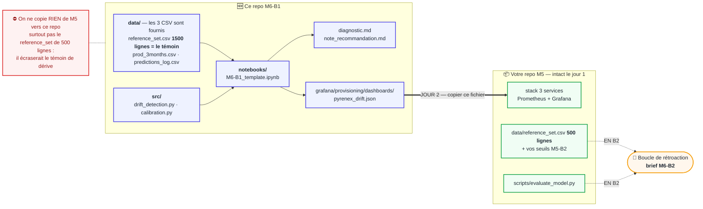

# M6-B1 — Analyser la performance et détecter la dérive (Pyrenex, 3 mois post-prod)

> **Repo template GitHub.** Un·e du binôme clique **« Use this template »** →
> `M6-B1-pyrenex-drift-<binome>`, ajoute l'autre en collaborateur. Vous
> diagnostiquez la dérive du modèle déployé en M5 et rendez une note à Sophie Léger.

---

## 🧭 Votre brief en un coup d'œil

**Ce README est votre document de pilotage unique** — tout ce qu'il faut faire,
dans l'ordre, avec le bon appui. Les autres supports ont chacun un rôle précis :

| Support | Rôle |
|---|---|
| **Simplonline** | Le contrat : contexte client, livrables, critères de performance |
| **Ce README** | Le pilotage : quoi faire, quand, avec quel mini-cours |
| [`ressources/`](./ressources/) | Les 5 mini-cours d'appui (index dans [`ressources/README.md`](./ressources/README.md)) |
| **Discord `fil-M6`** | Annonces + questions |

### Les 2 jours sync (binôme)

| Quand | Tâche | Durée | Appui |
|---|---|---|---|
| Mardi 9h15 | 1. Tirage binôme + harmonisation de la reprise M5 | 30 min | — |
| Mardi 9h45 | 2. Exploration des données prod (référence vs 3 mois) | 1h15 | — |
| Mardi 11h00 | 3. Détection statistique PSI / KS / Chi² + `drift_summary.md` | 1h30 | [`01_PSI_KS_Chi2`](./ressources/01_PSI_KS_Chi2_essentiel.md) |
| Mardi 12h30 | 4. 🍽️ Déjeuner | 1h | — |
| Mardi 13h30 | 5. Calibration : reliability diagram (ECE en bonus ⭐) | 1h | [`03_Calibration_modele`](./ressources/03_Calibration_modele_essentiel.md) |
| Mardi 14h30 | 6. Diagnostic data drift vs concept drift → `diagnostic.md` | 1h30 | [`02_Data_drift_vs_concept_drift`](./ressources/02_Data_drift_vs_concept_drift_essentiel.md) |
| Mardi 16h45 | 7. Mur réflexif intermédiaire | 15 min | — |
| Mercredi 9h15 | 8. Extension du dashboard Grafana M5 (3 panels **live**) | 45 min | [`05_Grafana_extension_dashboard`](./ressources/05_Grafana_extension_dashboard_essentiel.md) |
| Mercredi 10h00 | 9. Note de recommandation client | 1h15 | [`04_Note_recommandation_client`](./ressources/04_Note_recommandation_client_essentiel.md) |
| Mercredi 11h30 | 10. **Tour de table binômes** — diagnostics comparés | 1h | — |
| Mercredi 12h30 | 11. Mur réflexif final M6-B1 | 30 min | — |

### ✅ Checklist livrables (avant mercredi 12h30)

- [ ] `src/drift_detection.py` + `src/calibration.py` complétés — `pytest -q` vert
- [ ] PSI / KS / Chi² sur **toutes** les features pertinentes → `drift_summary.md`
- [ ] Diagnostic **chiffré et tranché** dans `diagnostic.md` (data vs concept
      drift — croisez features, AUC, calibration, temporalité)
- [ ] Note de recommandation **lisible par Sophie Léger** (pas ML), chiffrée,
      décision tranchée
- [ ] Dashboard M5 **étendu et provisionné** dans `grafana/provisioning/dashboards/` (**le seul dossier monté** par votre compose M5), pas de dashboard neuf, **aucun panel « No data »**
- [ ] 2 lignes de README : pourquoi PSI, KS, Chi² et F1-12-semaines restent dans le **notebook** (mesures batch) et pas dans Grafana
- [ ] Notebook exécuté top→bottom, commits `Co-authored-by:`, **journal de bord**

## 🗺️ Deux dépôts, et rien à fusionner

La question qui revient toujours : *« comment je répartis entre ce squelette et mon
code de M5-B2 ? »* Réponse : **on ne répartit pas.** Deux dépôts vivent côte à côte,
**un seul fichier voyage**, et il va de M6 vers M5 — jamais l'inverse.



Concrètement :

- **Jour 1** — vous travaillez à 100 % dans ce repo. Les données y sont, `pytest -q tests`
  est vert dès le clone : personne n'est bloqué par un Docker cassé ou un repo M5 froid.
- **Jour 2** — vous rouvrez votre repo M5 pour y **copier un seul fichier**, le JSON du
  dashboard, dans `grafana/provisioning/dashboards/`.
- **En B2** — votre jeu de 500 lignes, vos seuils et votre `evaluate_model.py` reprennent
  du service. Ils attendent où ils sont, vous n'y touchez pas avant.
- **La tâche 1 ne déplace aucun fichier.** Elle demande une décision **écrite dans ce
  README** : lequel de vos deux jeux M5-B2 servira à la boucle de B2, et pourquoi.

### 🎯 Décision — jeu de référence retenu pour la boucle B2

Nous disposons de deux jeux M5-B2, tous deux à 500 lignes avec golden run
et seuils hybrides (absolu + relatif, tolérances ≥ 2σ bootstrap) :

| | Jeremy | Nawelle |
|---|---|---|
| Composition | 350/150 (70/30) | 250/250 (50/50) |
| Golden run F1 macro | 0.6342 | 0.6517 |
| Reproductibilité du bruit | `scripts/measure_bootstrap_noise.py` | idem |

**Retenu : le jeu de Jeremy (70/30, 500 lignes, repo `m6-b1`).** Une
composition équilibrée à 250/250 comme celle de Nawelle est justement
l'exemple cité par le brief comme risque de faux garde-fou (« un garde-fou
calé sur un jeu équilibré 250/250 bloquerait une release parfaitement
saine ») : ce n'est pas disqualifiant en soi tant que golden run et seuils
sont mesurés sur le même jeu, mais c'est le choix le plus exposé à cette
critique. Le 70/30 réduit déjà le bruit sur le recall d'environ 30 %
(150 positifs vs ~92 en tirage naturel à 18,4 %) tout en restant plus
proche de la prévalence réelle — un compromis plus défendable pour le même
bénéfice recherché.

---

## 🚀 Démarrage

```bash
python -m venv .venv && source .venv/bin/activate
pip install -r requirements.txt
pytest -q tests            # vert dès le clone (certains tests se débloquent avec vos TODO)
jupyter notebook notebooks/M6-B1_template.ipynb
```

> Variante `uv` : `uv venv .venv && source .venv/bin/activate` puis
> `uv pip install -r requirements.txt`.
> Dépannage : `No module named pip` → vous êtes dans un venv créé par `uv`,
> utilisez `uv pip install …` (pas `pip install`).

Les **données sont fournies** dans `data/` : `reference_set.csv` (baseline),
`prod_3months.csv` (3 mois de prod), `predictions_log.csv` (logs du modèle).

## 🧭 Ce que vous construisez

| # | À faire | Fichier | Mini-cours |
|---|---|---|---|
| 1 | Détection PSI / KS / Chi² | `src/drift_detection.py` | `01` |
| 2 | Calibration (reliability diagram ; ECE en bonus ⭐) | `src/calibration.py` | `03` |
| 3 | Analyse complète | `notebooks/M6-B1_template.ipynb` | `01`,`02`,`03` |
| 4 | Diagnostic data vs concept drift | `diagnostic.md` | `02` |
| 5 | Logique de remédiation | `src/recommendations.py` | `02`, `04` |
| 6 | Note de recommandation | `note_recommandation_TEMPLATE.md` | `04` |
| 7 | Extension dashboard Grafana (3 panels **live**) | `grafana/provisioning/dashboards/pyrenex_drift.json` | `05` |
| 7⭐ | *(option)* publier le PSI à Prometheus sans nouveau service | `metrics/psi.prom` + compose + `prometheus.yml` | `05` |

### Pourquoi PSI, KS, Chi² et le F1 à 12 semaines ne sont pas dans Grafana

Ce sont des **mesures batch** : elles comparent le témoin `reference_set.csv`
(1500 lignes) à `prod_3months.csv` sur toute la fenêtre, un calcul ponctuel
lancé depuis le notebook — aucun service de la stack M5 ne les recalcule en
continu ni ne les expose sur `/metrics`. Le dashboard, lui, n'affiche que ce
que le service `model` calcule réellement à chaque requête (probabilités
prédites, classe prédite, volume, erreurs HTTP) : c'est la différence entre
un **diagnostic ponctuel** (notebook) et un **suivi en continu** (Grafana).

### Dashboard Grafana — `pyrenex_drift.json`

Testé en conditions réelles sur la stack M5 (`docker compose up`, 500
requêtes de `prod_3months.csv` envoyées à `/score`) avant d'être copié ici :
les 3 panels renvoient des données dès le démarrage, aucun `No data`.

- **Probabilités prédites (médiane / p90)** — `pyrenex_prediction_proba` (histogramme du service `model`)
- **Part des dossiers prédits en défaut** — `pyrenex_predictions_total`, ratio classe 1 / total
- **Volume et taux d'erreur** — `http_requests_total` (`model` + `backend`), scrape Prometheus exclu du volume

## ⭐ Extension (non notée, si socle bouclé) — dater la dérive

Le PSI global compare 3 mois de prod d'un bloc : il **moyenne** la dérive.
Recalculez le PSI **par fenêtres de 2 semaines** (colonne `timestamp` de
`prod_3months.csv`) pour les 3 features les plus mouvantes, et tracez la
courbe PSI × temps. Vous devez pouvoir répondre : **quand** la dérive
a-t-elle commencé, feature par feature ? Est-elle **progressive ou
brutale** — et qu'est-ce que ça change pour votre diagnostic (axe
temporalité) et pour la fenêtre d'intervention recommandée à Sophie Léger ?
Ajoutez la courbe à votre notebook et 3 lignes de lecture dans
`note_recommandation.md`.

## 📚 Ressources

Voir [`./ressources/`](./ressources/) — 5 mini-cours + `liens_officiels.md`.
