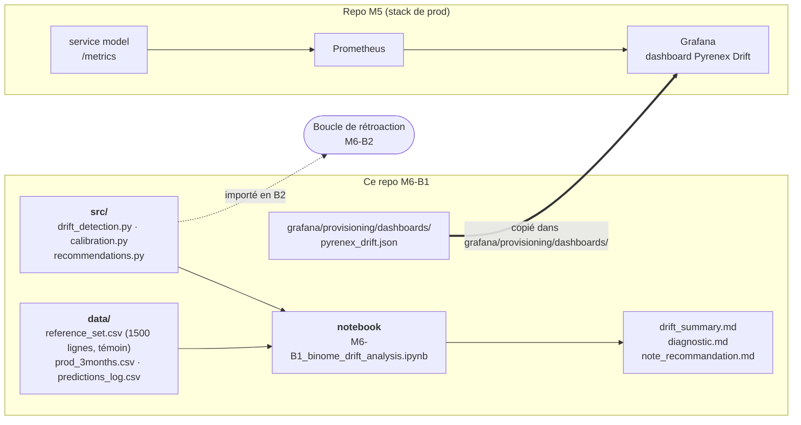

# M6-B1 — Analyse de la dérive de `pyrenex_risk_v2` (3 mois post-prod)

Binôme Jeremy Calvo · Nawelle Polin. Détection de la dérive (PSI, KS, Chi²),
distinction data drift / concept drift, calibration en exploitation,
diagnostic et note de recommandation pour Sophie Léger (Pyrenex Crédit).

## En bref

- **Data drift confirmé** : `int_rate` (PSI 0,44, KS p=4,6e-65) et `grade`
  (Chi² p=3,7e-7) ; `revol_util` en zone grise (PSI 0,19).
- **Pouvoir de tri intact** : AUC 0,7419 (semaines 1-4) → 0,7459 (semaines 9-12).
- **Calibration dégradée** : modèle sur-confiant (ECE 0,24 → 0,32), en
  cohérence avec le recul du F1 macro (0,6085 → 0,5506) au seuil de décision fixe.
- **Recommandation** : recalibrer les probabilités sous 2 semaines
  (~2 jours-homme) ; réentraînement complet écarté (~8 jours-homme pour un
  gain attendu nul sur l'AUC).

## Livrables

| Livrable | Fichier |
|---|---|
| Détection PSI / KS / Chi² | [`src/drift_detection.py`](./src/drift_detection.py) |
| Calibration (reliability diagram, ECE) | [`src/calibration.py`](./src/calibration.py) |
| Logique de diagnostic et remédiation | [`src/recommendations.py`](./src/recommendations.py) |
| Analyse complète (appelle `src/`) | [`notebooks/M6-B1_binome_drift_analysis.ipynb`](./notebooks/M6-B1_binome_drift_analysis.ipynb) |
| Tableau de synthèse par feature | [`drift_summary.md`](./drift_summary.md) |
| Diagnostic data vs concept drift | [`diagnostic.md`](./diagnostic.md) |
| Note client (Sophie Léger) | [`note_recommandation.md`](./note_recommandation.md) |
| Extension dashboard Grafana M5 | [`grafana/provisioning/dashboards/pyrenex_drift.json`](./grafana/provisioning/dashboards/pyrenex_drift.json) |

## Architecture



Le calcul vit dans `src/` ; le notebook l'importe sans le recopier, pour que
la boucle de M6-B2 puisse réutiliser les mêmes fonctions.

## Reproduire

```bash
python -m venv .venv && source .venv/bin/activate
pip install -r requirements.txt
pytest -q tests
jupyter notebook notebooks/M6-B1_binome_drift_analysis.ipynb   # Restart & Run All
```

Dashboard, depuis le repo M5 (où `pyrenex_drift.json` est copié dans
`grafana/provisioning/dashboards/`) :

```bash
docker compose up -d
```

Puis ouvrir <http://localhost:3000/d/pyrenex-drift> (dashboard « Pyrenex
Drift — suivi dérive v2 »).

## Décision — jeu de référence retenu pour la boucle B2

Le `reference_set.csv` de ce repo (1500 lignes, 17,5 % de défauts) sert
uniquement de témoin de dérive pour M6-B1 et n'est pas remplacé.

Pour la boucle B2, nous disposons de deux jeux M5-B2, tous deux à 500 lignes
avec golden run et seuils hybrides (absolu + relatif, tolérances ≥ 2σ
bootstrap) :

| | Jeremy | Nawelle |
|---|---|---|
| Composition | 350/150 (70/30) | 250/250 (50/50) |
| Golden run F1 macro | 0.6342 | 0.6517 |
| Reproductibilité du bruit | `scripts/measure_bootstrap_noise.py` | idem |

**Retenu : le jeu de Jeremy (70/30, 500 lignes, repo `m6-b1`).** Une
composition équilibrée à 250/250 est l'exemple cité comme risque de faux
garde-fou (« un garde-fou calé sur un jeu équilibré 250/250 bloquerait une
release parfaitement saine ») : ce n'est pas disqualifiant en soi tant que
golden run et seuils sont mesurés sur le même jeu, mais c'est le choix le
plus exposé à cette critique. Le 70/30 réduit déjà le bruit sur le recall
d'environ 30 % (150 positifs vs ~92 en tirage naturel à 18,4 %) tout en
restant plus proche de la prévalence réelle. Ses seuils restent valides tels
quels : aucune recalibration nécessaire.

## Dashboard Grafana — `pyrenex_drift.json`

Extension du dashboard M5 (pas de dashboard neuf). Testé sur la stack M5
(`docker compose up`, 500 requêtes de `prod_3months.csv` envoyées à
`/score`) : les 3 panels renvoient des données dès le démarrage, aucun
« No data ».

- **Probabilités prédites (médiane / p90)** — `pyrenex_prediction_proba` (histogramme du service `model`)
- **Part des dossiers prédits en défaut** — `pyrenex_predictions_total`, ratio classe 1 / total
- **Volume et taux d'erreur** — `http_requests_total` (`model` + `backend`), scrape Prometheus exclu du volume

### Pourquoi PSI, KS, Chi² et le F1 à 12 semaines ne sont pas dans Grafana

Ce sont des **mesures batch** : elles comparent le témoin `reference_set.csv`
à `prod_3months.csv` sur toute la fenêtre, un calcul ponctuel lancé depuis le
notebook, qu'aucun service de la stack M5 ne recalcule ni n'expose sur
`/metrics`. Grafana n'affiche que ce que le service `model` produit à chaque
requête : diagnostic ponctuel dans le notebook, suivi continu dans Grafana.

## Ressources

Mini-cours d'appui dans [`ressources/`](./ressources/).
